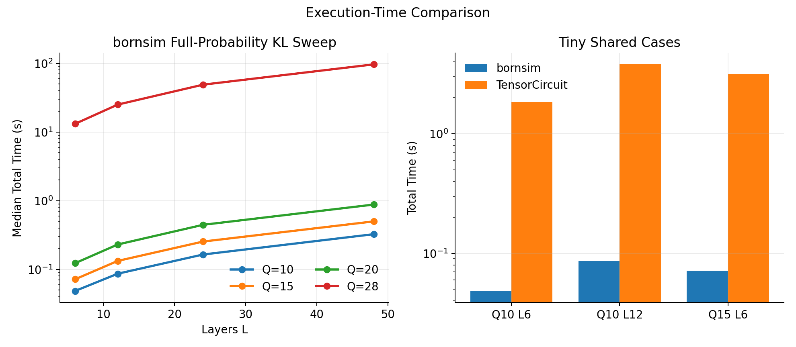

# bornsim

bornsim is a single-GPU exact statevector simulator for training Born machines with full-probability losses. It is built around one circuit family, `RY-RZ-RZZ`, with an arbitrary user-supplied RZZ coupling graph and a manual adjoint reverse pass for analytic gradients of scalar losses defined on the full output probability vector.

The package is intentionally narrow: it is not a general quantum SDK. The goal is to make one expensive workload practical on commodity NVIDIA hardware: exact full-distribution training without parameter-shift over every circuit parameter and without an autodiff tape over the probability vector. On a 24 GB GPU, the measured examples reach 28 qubits.

The public API covers immutable circuit descriptions, 4-neighbor and king-move grid topology helpers, KL and MMD losses, Adam-based training, probability utilities, and gradient agreement tests against PennyLane references. The initializer maps empirical one-bit marginals to first-layer `RY` angles, calibrates first-layer `RZZ` angles against arbitrary supplied pair correlations on the chosen coupling edges, and optionally adds small random noise to later layers.

In a bounded Nsight Compute sample of 20 custom kernel launches on RTX 3090, the measured mean DRAM throughput was 91.9% of peak.

For the specific workload this repository targets, the comparison point is exact statevector simulation with a full probability vector and an analytic gradient of a scalar loss built on top of those probabilities. Across the measured 4-neighbor-grid synthetic full-probability KL sweep, runtime scaled close to linearly with depth while memory stayed effectively flat at fixed qubit count. At the large end of the measured range, `Q=28, L=48` took about `24.3s` forward, `71.6s` backward, `96.9s` total, and used about `16.8 GiB` of GPU memory.



What was evaluated for the same purpose and why it did not replace bornsim:

| backend | what was tested | why it did not satisfy the target workload |
|---|---|---|
| `PennyLane lightning.gpu` | `qml.probs(...)` with `diff_method="adjoint"` on the same `RY-RZ-RZZ` circuit family | Adjoint rejected the full-probability circuit directly: `QuantumFunctionError`, so this path did not provide `probs -> scalar loss` gradients. |
| `Qiskit Aer` | GPU statevector forward plus the installed Qiskit gradient stack | Forward simulation worked, but the probability-gradient path exposed sampler-side parameter-shift style methods rather than reverse-mode or adjoint for full probabilities. |
| `TensorCircuit` | Tiny JAX full-probability autodiff probe on the same circuit family | After local NumPy-2 compatibility fixes, the tiny `Q=10, L=6` full-probability path worked, but it measured about `7.2s` forward and `17.1s` backward there, so it was far slower than bornsim even before scaling up. |
| `Qibo/Qiboml` | Tiny full-probability JAX-backed gradient probe | A tiny analytic probability-gradient case worked, but the local backend selected CPU execution and emitted large failed GPU allocation attempts, so it was not a practical single-GPU path here. |

As an apples-to-oranges reference point, a Qiskit Aer shot-based estimator was also tested on an easier expectation-value task (`sum_i Z_i`) at `Q=10, L=6`. Even there, `10^6` shots still gave about `7.8e-4` run-to-run standard deviation and about `1.8e-4` mean absolute error versus the exact expectation, which is useful for observables but not a substitute for exact full-probability gradients.

A transparent lower-bound memory-efficiency estimate at `Q=28` is `payload_bytes_min / peak_bytes`, with `payload_bytes_min = 2 * state_bytes + prob_bytes`. For this workload the lower bound is about `5.0 GiB / 16.4 GiB = 30.5%`.

The main engineering choices behind the gap are:

- manual adjoint reverse pass instead of generic parameter-shift
- no autodiff tape over the full probability vector
- specialized diagonal `RZ` and `RZZ` kernels instead of routing everything through generic dense gate application
- depth-flat adjoint memory use
- fixed circuit family and topology, which removes framework overhead that matters at large `2^Q` state sizes

Install:
```
pip install -e .
```

Generate data (downloads MNIST, binarizes to 5x5 V6_otsu encoding):
```
python examples/generate_v6_otsu.py --output-dir ./data/V6_otsu
```

Train Born machine at L=6 for 500 steps:
```
python examples/train_l6_500.py --depth 6 --steps 500 --data-path ./data/V6_otsu
```

Run gradient agreement tests against PennyLane reference:
```
pip install -e .[test]
pytest tests/
```

Re-run the comparison harnesses:
```
python examples/performance_test/backend_alternatives_probe.py
python examples/performance_test/estimator_side_probe.py
python examples/performance_test/bornsim_readme_sweep.py
python examples/performance_test/build_readme_timing_figure.py
```
